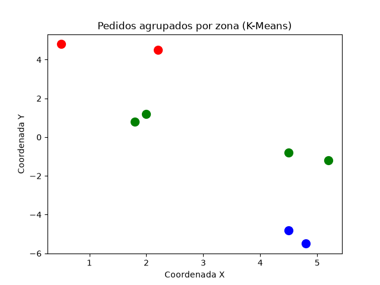

# sabor-express-rota-inteligente

## 1. Descrição do problema e objetivos
A Sabor Express é uma pequena empresa de delivery de alimentos que enfrenta grandes desafios para gerenciar suas entregas, especialmente nos horários de pico (almoço e jantar). Atualmente, as rotas são definidas manualmente pelos entregadores, com base apenas na experiência, o que causa atrasos, maior gasto com combustível e insatisfação dos clientes. O objetivo deste projeto é resolver esse problema criando uma solução baseada em algoritmos de Inteligência Artificial, capaz de sugerir as melhores rotas de entrega.

## 2. Escopo da solução
- **Grafo**: a cidade será representada como um grafo, onde bairros são nós e ruas são arestas com peso (distância).
- **A\***: algoritmo usado para encontrar o caminho mais curto entre a loja e os pontos de entrega.
- **K-Means**: usado para agrupar pedidos próximos em zonas, dividindo o trabalho entre entregadores.

## 3. Algoritmos utilizados

- **BFS**: encontra o caminho com menos ruas percorridas, mas não considera a distância real.
- **DFS**: encontra um caminho válido, mas pode ser bem mais longo que o necessário.
- **A\***: usa a distância real das ruas somada a uma estimativa de distância até o destino, encontrando o caminho mais curto de forma eficiente.
- **K-Means**: agrupa pedidos que estão próximos geograficamente em zonas, permitindo dividir o trabalho entre vários entregadores.

## 4. Diagrama e resultados

Comparando os três algoritmos de busca no mesmo trajeto (Loja até Bela_Vista):

| Algoritmo | Caminho encontrado | Distância |
|---|---|---|
| BFS | Loja → Centro → Parque_Alto → Bela_Vista | 6.7 km |
| DFS | Loja → Centro → Jardim_Sul → Vila_Nova → Bela_Vista | 15.2 km |
| A\* | Loja → Centro → Parque_Alto → Bela_Vista | 6.7 km |

O A* encontrou o mesmo caminho ótimo que o BFS, mas usando uma heurística para guiar a busca, o que o torna mais eficiente em grafos maiores (com mais bairros e ruas).

O K-Means, ao agrupar os 8 pedidos simulados em 3 zonas, permite que cada entregador cuide de uma região específica, reduzindo a distância percorrida por cada um.

## 5. Limitações e sugestões de melhoria

- O grafo e os pedidos usados são **simulados**, não representam uma cidade real.
- A rota para múltiplos pedidos ainda não foi implementada (o projeto resolve caminho entre dois pontos, não uma rota completa visitando vários pedidos em sequência).
- Como melhoria futura, seria possível integrar dados reais de mapas (Google Maps, OSRM) e testar diferentes quantidades de zonas no K-Means.